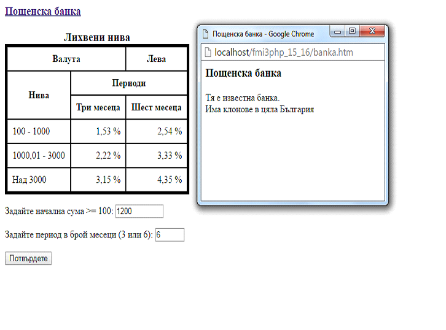
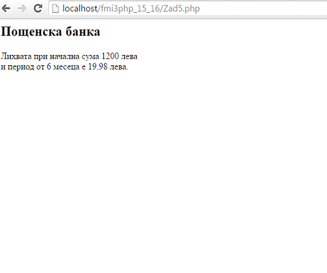

# postbank-interest-rates-php
Да се създаде приложение за изчисляване и извеждане на лихвата на въведена начална сума >= 100 за въведен период, който да бъде стойност 3 или 6, според следната таблица, която се извежда на екрана:

 Да се направи проверка за коректност на въведените данни за сума и период.
 Да се извежда информация за Пощенска банка при кликване в името й.

 Тестови данни за сума s и период p, а резултатът (лихвата) е w:
 1.1) s = 400; p=3 => w=1,53; 1.2) s = 1200; p=3 => w= 6,66; 1.3) s = 3600; p=3 => w=28,35;
 2.1) s = 400; p=6 => w=5,08; 2.2) s = 1200; p=6 => w=19,98;  2.3) s = 3600; p=6 => w=78,30
